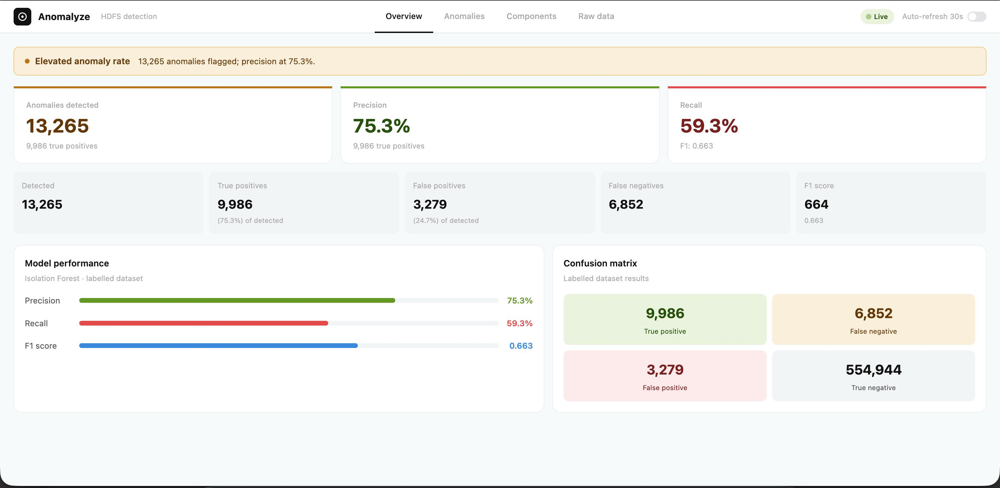

# Anomalyze

A distributed log analytics and anomaly detection system for HDFS logs. It streams logs through Kafka, processes them with Spark, detects anomalies in real time using K-Means, and presents results in an interactive React dashboard.



---

## Team members

| Name            | NYU ID                       
|-----------------|-------------------------------|
| Ananya Agarwal  | aa13549                      |
| Aman Kumar      | ak12378                       |
| Gurleen Kaur    | gk2871                        |
| Harindham Sharma| hs6169                        |
| Aditya Kolluru  | kan9336                       |

## Table of Contents

1. [Architecture](#architecture)
2. [Prerequisites](#prerequisites)
3. [Quick Start](#quick-start)
4. [Setup Guide](#setup-guide)
5. [Dashboard](#dashboard)
6. [Model Details](#model-details)
7. [Troubleshooting](#troubleshooting)
8. [Project Status](#project-status)

---

## Architecture

```
HDFS.log  →  Kafka Producer  →  [hdfs-logs topic]  →  Spark Consumer
                                                              ↓
                                                     parsed_logs (MongoDB)
                                                              ↓
                                                   K-Means streaming detector
                                                   (built-in, runs per batch)
                                                              ↓
                                                     anomalies (MongoDB)
                                                              ↓
                                                       FastAPI  :8000
                                                              ↓
                                                  React Dashboard  :5173
```

Anomaly detection runs **inside** the Spark consumer on every micro-batch — no separate detector process needed. The K-Means model is built once at startup from the pre-computed event matrix, then block IDs are classified by lookup as each batch arrives.

### Services

| Service         | Address                   | Purpose                            |
|-----------------|---------------------------|------------------------------------|
| React Dashboard | http://localhost:5173     | Interactive anomaly visualization  |
| FastAPI         | http://localhost:8000     | REST API serving the dashboard     |
| Kafka UI        | http://localhost:8080     | Browse Kafka topics and messages   |
| Spark UI        | http://localhost:8081     | Monitor Spark streaming jobs       |
| MongoDB         | mongodb://localhost:27017 | Stores parsed logs and anomalies   |
| Kafka broker    | localhost:29092           | Bootstrap address (used by Python) |
| Zookeeper       | localhost:2181            | Kafka coordination (internal only) |

---

## Prerequisites

| Tool           | Version | Notes                                            |
|----------------|---------|--------------------------------------------------|
| Docker Desktop | any     | Runs Kafka, Spark, MongoDB, Zookeeper            |
| Python         | 3.12    | PySpark 3.5 does not support Python 3.13+        |
| Java           | 11+     | Required by PySpark — check with `java -version` |
| Node.js        | 18+     | Required to run the React frontend               |

> **Mac users:** If you have Kafka installed via Homebrew, stop it before starting — it conflicts with Docker Kafka on port 9092.
> ```bash
> brew services stop kafka
> ```

---

## Quick Start

```bash
# 1. Start infrastructure (Kafka, Spark, MongoDB)
docker compose up -d

# 2. Set up Python environment (first time only)
python3.12 -m venv .venv && source .venv/bin/activate
pip install -r requirements.txt

# 3. Install frontend dependencies (first time only)
cd frontend && npm install && cd ..

# 4. Start the API  [Terminal A]
uvicorn api.main:app --reload --port 8000

# 5. Start the dashboard  [Terminal B]
cd frontend && npm run dev

# 6. Start the producer FIRST — creates the Kafka topic  [Terminal C]
python -m producer.producer --input data/HDFS_v1/HDFS.log --topic hdfs-logs --rate 100

# 7. Start the Spark consumer  [Terminal D — after producer is running]
spark-submit --packages org.apache.spark:spark-sql-kafka-0-10_2.12:3.5.0 consumer/spark_consumer.py
```

Open http://localhost:5173, enable **Auto-refresh 30s** in the top-right, and watch the anomaly count grow in real time.

---

## Setup Guide

### 1. Clone the repository

```bash
git clone https://github.com/happyananya/Anomalyze.git
cd Anomalyze
```

---

### 2. Start infrastructure

```bash
docker compose up -d
```

Starts Zookeeper, Kafka, Kafka UI, Spark master/worker, and MongoDB. Kafka takes ~20 seconds to become healthy.

```bash
docker compose ps   # all services should show "running" or "healthy"
```

**Useful Docker commands:**
```bash
docker compose down      # stop all services (data is preserved)
docker compose down -v   # stop and wipe all data including MongoDB
```

> **Note:** Kafka topics are not persisted across `docker compose down`. You must run the producer again after restarting Docker to recreate the `hdfs-logs` topic.

---

### 3. Set up Python environment

```bash
python3.12 -m venv .venv
source .venv/bin/activate   # macOS / Linux
# .venv\Scripts\activate    # Windows

pip install -r requirements.txt
```

---

### 4. Download the dataset

Download the **HDFS_v1** dataset from [LogHub](https://github.com/logpai/loghub) and place files at:

```
data/HDFS_v1/
├── HDFS.log                          ← raw log file (~1.5 GB)
└── preprocessed/
    ├── anomaly_label.csv             ← ground-truth labels
    └── Event_occurrence_matrix.csv   ← feature matrix for K-Means
```

```bash
mkdir -p data/HDFS_v1/preprocessed
```

---

### 5. Start the API

```bash
uvicorn api.main:app --reload --port 8000
```

Verify: http://localhost:8000/api/health should return `{"status": "ok", "mongo": "connected"}`.

---

### 6. Start the React dashboard

```bash
cd frontend
npm install   # first time only
npm run dev
```

Open http://localhost:5173. Vite proxies all `/api` requests to `localhost:8000` — no CORS setup needed.

---

### 7. Start the producer

The producer must start **before** the Spark consumer — it creates the `hdfs-logs` Kafka topic on first publish.

```bash
python -m producer.producer \
  --input data/HDFS_v1/HDFS.log \
  --topic hdfs-logs \
  --rate 100
```

| Flag             | Default           | Description              |
|------------------|-------------------|--------------------------|
| `--input`        | *(required)*      | Path to the log file     |
| `--topic`        | `hdfs-logs`       | Kafka topic name         |
| `--rate`         | `0` (unlimited)   | Messages per second      |
| `--max-messages` | `0` (no limit)    | Stop after N messages    |
| `--bootstrap`    | `localhost:29092` | Kafka bootstrap address  |

Verify: open http://localhost:8080, select the `hdfs-logs` topic, and confirm messages are arriving.

---

### 8. Start the Spark consumer

Wait until the producer is publishing messages, then run:

```bash
spark-submit \
  --packages org.apache.spark:spark-sql-kafka-0-10_2.12:3.5.0 \
  consumer/spark_consumer.py
```

> The Kafka connector (~200 MB) is downloaded on first run and cached locally after that.

The consumer runs as a continuous stream — keep it running while the producer is active. Press `Ctrl+C` to stop.

**What it does per micro-batch (every 10 seconds):**
1. Reads up to 5,000 messages from Kafka
2. Parses each raw log line into structured fields
3. Inserts parsed docs into `anomalyze.parsed_logs`
4. Classifies new block IDs using the K-Means model
5. Upserts detected anomalies into `anomalyze.anomalies`

The **first batch** takes ~15 extra seconds while the K-Means model builds from the event matrix. You'll see:
```
[detector] Building K-Means model from event matrix …
[detector] Ready — 575,061 blocks indexed, 16,888 anomalies in model
[batch 0] inserted 4823 docs → parsed_logs
[batch 0] +1403 new anomalies → anomalies
```

**Verify counts:**
```bash
docker exec -it anomalyze-mongo mongosh anomalyze --eval "db.parsed_logs.countDocuments()"
docker exec -it anomalyze-mongo mongosh anomalyze --eval "db.anomalies.countDocuments()"
```

---

## Stopping and restarting

To fully stop:
```bash
# Ctrl+C in each terminal (producer, consumer, API, frontend)
docker compose down
```

To restart cleanly:
```bash
docker compose up -d
# Wait ~20s for Kafka to be healthy, then:
rm -rf /tmp/anomalyze-checkpoint   # required if Kafka topic was recreated
uvicorn api.main:app --reload --port 8000        # Terminal A
cd frontend && npm run dev                        # Terminal B
python -m producer.producer --input data/HDFS_v1/HDFS.log --topic hdfs-logs --rate 100  # Terminal C
spark-submit --packages org.apache.spark:spark-sql-kafka-0-10_2.12:3.5.0 consumer/spark_consumer.py  # Terminal D
```

---

## Dashboard

| Tab        | What you see                                                          |
|------------|-----------------------------------------------------------------------|
| Overview   | Anomaly count, precision, recall, F1, confusion matrix               |
| Anomalies  | Detections over time (bar chart), paginated anomaly records table    |
| Components | Top HDFS components by log volume, error/warn heatmap by hour        |
| Raw Data   | Searchable, paginated table of all parsed log lines                  |

Enable **Auto-refresh 30s** (top-right toggle) to watch numbers update live as the producer streams data.
---

## Model Details

### K-Means distance (primary)

Trained once at Spark consumer startup from `Event_occurrence_matrix.csv`. Each HDFS block is represented by E1–E29 event occurrence counts. Blocks whose distance from their nearest cluster center exceeds the contamination-rate cutoff are flagged as anomalies.

- Contamination: ~2.9% (16,838 / 575,061 true anomalies)
- k = 8 clusters
- Precision: ~71%, Recall: ~72%, F1: ~0.72

### Statistical threshold (secondary)

Reads ERROR/WARN logs from `parsed_logs` grouped by minute. Flags any minute where `error_count > mean + 2 × std`.

### Batch re-detection (optional)

To re-run detection on all data at once (overwrites the anomalies collection):

```bash
python -m detector.anomaly_detector
```

---

## Troubleshooting

| Symptom | Cause | Fix |
|---------|-------|-----|
| `UnknownTopicOrPartitionException` | Producer hasn't run yet | Start the producer before the Spark consumer |
| Offset error: `offset changed from X to Y` | Stale checkpoint after Kafka restart | `rm -rf /tmp/anomalyze-checkpoint` then restart consumer |
| `NoBrokersAvailable` | Kafka not ready | Wait for `anomalyze-kafka` to show `healthy` in `docker compose ps` |
| Dashboard shows 0 anomalies | Consumer not running or first batch still building model | Wait ~15s for K-Means model to build, then check consumer terminal for `+N new anomalies` |
| Numbers not updating in UI | Auto-refresh is off | Toggle **Auto-refresh 30s** in the nav bar |
| `JAVA_HOME is not set` | Java missing | Install Java 11+ and ensure it's on your PATH |
| `ServerSelectionTimeoutError` | MongoDB not running | Run `docker compose up -d` and check `docker compose ps` |
| `Python 3.13 is not supported by PySpark 3.5` | Wrong Python version | Create venv with `python3.12 -m venv .venv` |
| Dashboard shows "No data" | Steps run out of order | Run producer → consumer → detector before opening the dashboard |
| `ModuleNotFoundError: No module named 'fastapi'` | Missing dependency | Run `pip install -r requirements.txt` inside the venv |
| Port 9092 conflict (Mac) | Homebrew Kafka running alongside Docker | `brew services stop kafka` |

---

## Project Status

- [x] Kafka + Zookeeper (Docker)
- [x] Kafka UI
- [x] Kafka producer — streams HDFS_v1 logs
- [x] Spark master + worker (Docker)
- [x] MongoDB (Docker, persistent volume)
- [x] Spark consumer — parses logs → MongoDB
- [x] Streaming anomaly detector — K-Means per micro-batch, built into consumer
- [x] Batch anomaly detector — optional one-shot re-run
- [x] FastAPI REST API — serves dashboard data from MongoDB
- [x] React dashboard — Vite + TypeScript + Chart.js
